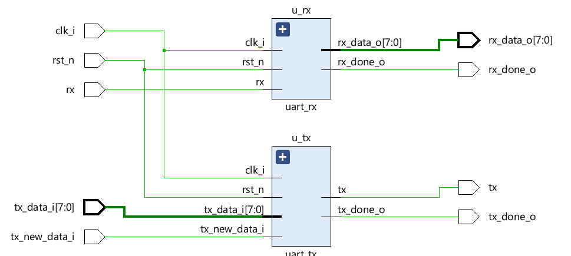

## Top Module Diagram
Encapsulates 2 modules inside: `uart_tx`, and `uart_rx`.

### uart_top signals:
|signals |Direction| Descriptions|
|--------|----|---------|
|`tx_data_i` |input| 8-bit data to take in|
|`tx_new_data_i`|input| When asserted it asks the module to take in the new `tx_data_i`|
|`tx_done_o`|output|Indicates whether the current transaction is complete|
|`rx_data_o`|output|Outputs 8-bit of data|
|`rx_done_o`|output| indicates whether the receiver has done receicving|
|`rx`|input|Physical UART receiver pin|
|`tx`|output|Physical UART transmitter pin|

### uart_tx signals:

### uart_rx signals:
